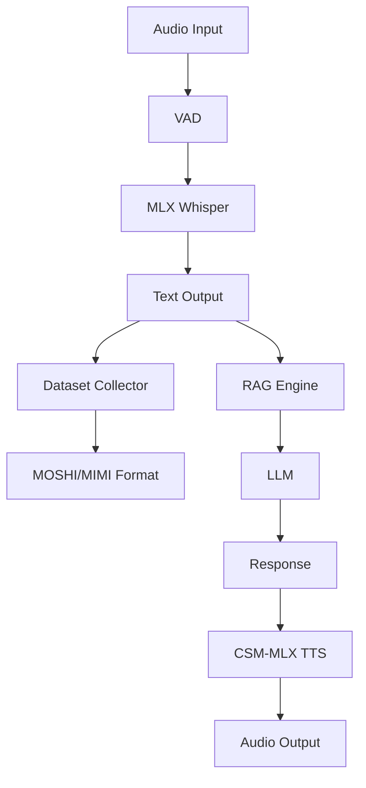

# lbrxVoicePro Architecture

## System Design for Sesame AI Labs

### Overview

lbrxVoicePro is a production-ready voice AI pipeline optimized for Apple Silicon, designed for:
1. **Dataset Collection** - MOSHI/MIMI format for TTS training
2. **Conversational AI** - Local LLM + universal RAG
3. **Polish Language** - Focus on Polish ASR/TTS

### Core Architecture



### Key Components

#### 1. Voice Pipeline (core/)
- **AudioRecorder**: Cross-platform audio I/O
- **VAD**: Silero-based voice activity detection
- **Pipeline**: Orchestrates ASR workflow

#### 2. Dataset Collection (dataset/)
- **Collector**: Records voice-text pairs
- **Formatter**: Converts to MOSHI/MIMI format
- **Validator**: Ensures data quality

#### 3. Model Integration (models/)
- **Whisper MLX**: Polish-optimized ASR
- **CSM-MLX**: Polish TTS (CSM-1B)
- **RAG**: Universal knowledge base

#### 4. API Layer (api/)
- **REST**: File-based operations
- **WebSocket**: Real-time streaming
- **gRPC**: High-performance RPC (planned)

### Performance Characteristics

| Component | Latency | Throughput | Hardware |
|-----------|---------|------------|----------|
| ASR | <100ms | 10x realtime | M1 Pro |
| TTS | <200ms | 5x realtime | M1 Pro |
| RAG | <50ms | 1000 QPS | M1 Pro |

### Deployment Architecture

```yaml
# Docker Compose example
services:
  api:
    image: lbrxvoicepro:latest
    ports:
      - "8000:8000"
    volumes:
      - ./models:/app/models
      - ./dataset:/app/dataset
    
  whisper:
    image: lbrxvoicepro:whisper
    ports:
      - "8123:8123"
      - "8126:8126"
    
  csm:
    image: lbrxvoicepro:csm
    ports:
      - "8135:8135"
```

### Integration with CSM-MLX

1. **Training Pipeline**
   ```bash
   # Collect dataset
   lbrxvoicepro collect --hours 10 --speaker polish_male
   
   # Convert to MOSHI format
   lbrxvoicepro convert --format moshi --output dataset/
   
   # Fine-tune CSM
   cd /path/to/csm-mlx
   python -m csm_mlx.finetune --config lbrx_config.json
   ```

2. **Inference Pipeline**
   ```python
   from lbrxvoicepro import VoicePipeline, CSMSynthesizer
   
   pipeline = VoicePipeline()
   tts = CSMSynthesizer()
   
   # Process voice
   text = await pipeline.transcribe(audio)
   response = await llm.generate(text)
   audio = await tts.synthesize(response)
   ```

### Scaling Considerations

1. **Horizontal Scaling**
   - Stateless API servers
   - Model replicas with load balancing
   - Redis for session management

2. **Vertical Scaling**
   - M1 Max: 2x performance
   - M2 Ultra: 4x performance
   - Batch processing for throughput

### Security & Privacy

1. **Data Protection**
   - On-device processing
   - No cloud dependencies
   - Encrypted storage

2. **Access Control**
   - JWT authentication
   - Role-based permissions
   - API rate limiting

---

Ready for Sesame AI Labs integration.
Contact: team@libraxis.com